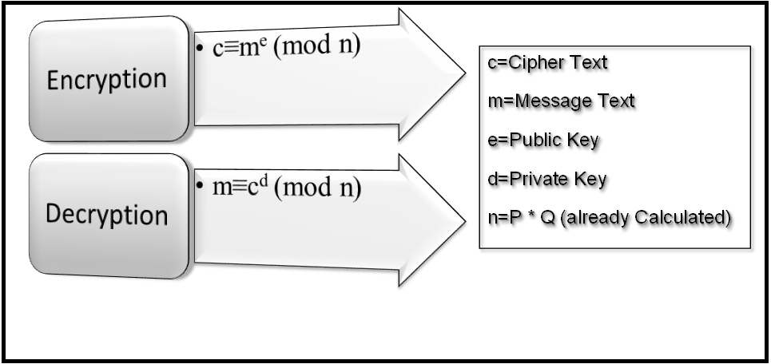

### RSA Encryption and Decryption


 This is a simple RSA encryption and decryption tool created in Python. It uses socket programming to communicate with a server and perform RSA encryption and decryption

#### Requirements
- Python 3.x
- Socket 
- matplotlib 
- threading
- math

***How to run***
1. Clone the repository by running the following command in your terminal:

```
 Clone the repository https://github.com/ZiadSheriif/Cryptosystem-RSA.
 ```
 2. Navigate to the directory where the repository was cloned:

 ```
 cd Cryptosystem-RSA
```
3. Start the server by running the following command:


```
python server.py
```
4. In another terminal window, start the client by running the following command:


```
python client.py
```
5. In another terminal window, start the attacker by running the following command:

```
python attacker.py
```
6. Enter a message to encrypt on the client side.
7. The **encrypted message** will be sent to the **server**, which will decrypt it and return the **decrypted message** to the **client**.


***RSA Algorithm***


<a id ="Contributors"></a>
##  Contributors

<table >
  <tr>
        <td align="center"><a href="https://github.com/ZiadSheriif"><br /><sub><b>Ziad Sherif </b></sub></a><br /></td>
        </tr>
</table>

> This software is licensed under MIT License,
> See [License](https://github.com/ZiadSheriif/Cryptosystem-RSA/blob/master/License) for more information ©ZiadSheriif.